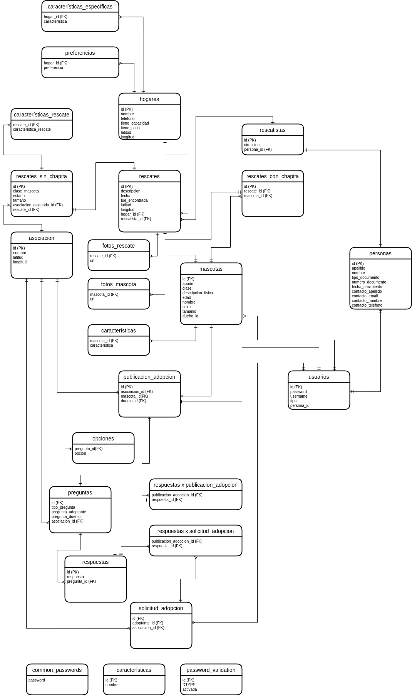
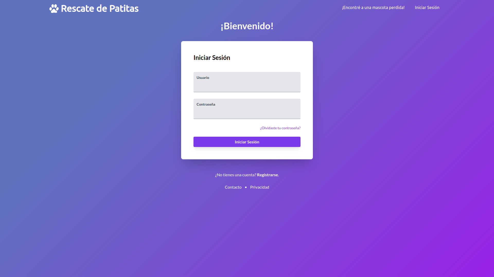
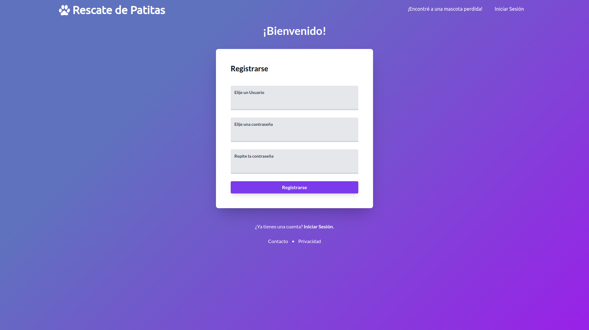
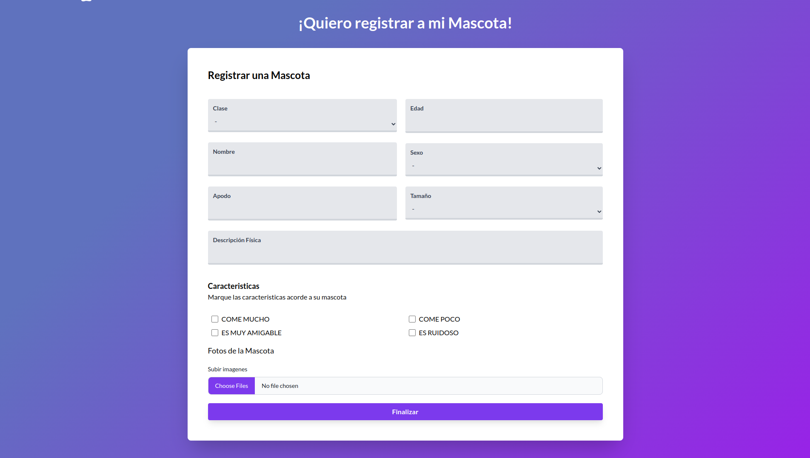
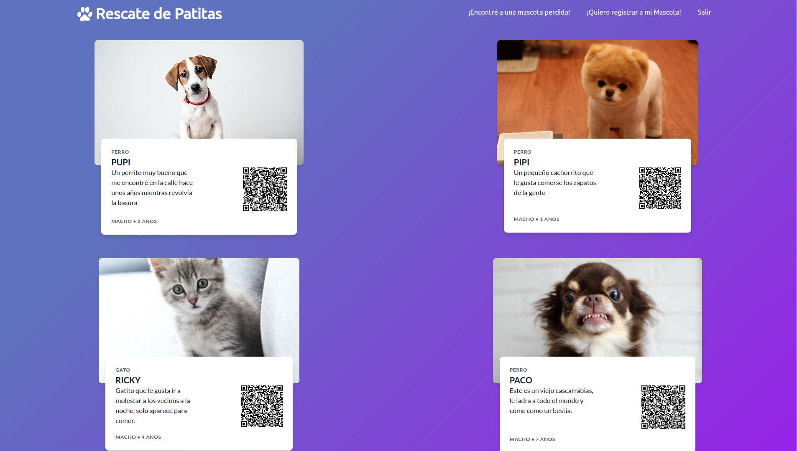
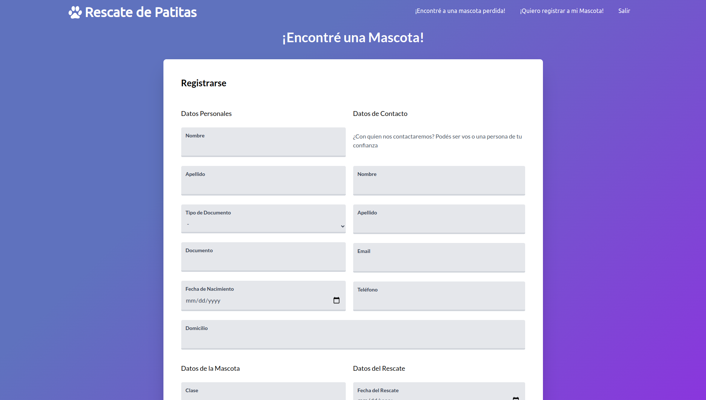
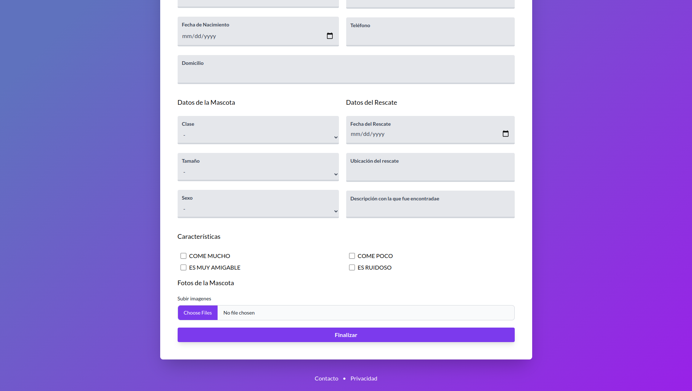
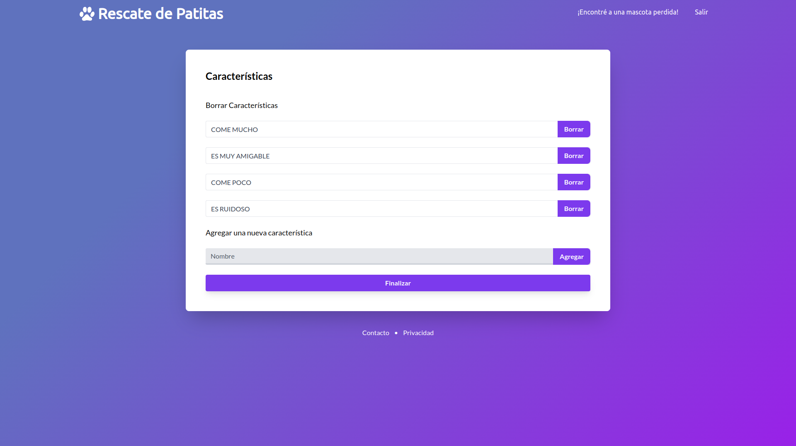

# Rescate de Patitas

## Trabajo Práctico - GRUPO 7 - Diseño de Sistemas - 2021 - Jueves Mañana

### Resumen

El siguiente trabajo consiste en una aplicación web que permita a una persona registrarse como dueño de una o varias mascotas. La asociación enviará al dueño una chapita con un código QR que identifica unívocamente a la mascota, y en el caso de que se pierda la mascota, el rescatista pueda identificar al dueño mediante el escaneo del código QR.
Además el sistema debe permitir la publicación de mascotas en adopción, así como también la solicitud de adopción por parte de algún adoptante. En estas publicaciones se harán preguntas sobre las preferencias del adoptante, o las características del animal; para luego ejecutar un algoritmo de recomendaciones que permita matchear mascota con adoptante. En el caso de que el dueño no pueda tener a la mascota, el sistema deberá proveer de información acerca de hogares que estén dispuestos a recibir a la mascota mediante el uso de una API Rest. Además las publicaciones deben ser aprobadas por voluntarios de asociaciones registradas en el sistema. Por último, los administradores del sistema deberán poder elegir qué características son las que se les preguntarán a los dueños o rescatistas sobre el animal, así como también decidir cuáles validaciones sobre la seguridad de las contraseñas se harán.

Para el desarrollo del trabajo práctico se deberán utilizar, de ser necesario, patrones de diseños vistos durante la cursada para realizar el modelo de objetos; consultar una API Rest; realizar tests unitarios y mockear aquellos componentes que interactúan con sistemas externos; realizar tareas programadas (cronjobs) para enviar mails de recomendaciones; realizar el modelo de datos teniendo en cuenta las formas normales así como también la performance de las consultas; implementar persistencia mediante el uso de un motor de base de datos relacional; realizar las vistas de algunos casos de uso de la aplicación; realizar los controladores de la aplicación; realizar un deploy de la aplicación en algún proveedor PaaS o IaaS. 

Bibliotecas Utilizadas:

- Spark
- Hibernate/JPA
- JavaMail
- Retrofit
- JUnit5

| ALUMNO                            | LEGAJO        |               
| ----------------------------------|:-------------:|
| Alexis Herasimiuk                 | 167.251-4     |
| Ian Crespi                        | 167.397-0     |
| Emmanuel Lazarte                  | 168.926-5     |
| Nicolás Williman                  | 163.690-0     |
| Federico Silva                    | 167.439-0     |
| Camil Loyola                      | 161.626-2     |


Ayudante: fedekiwo

----

# Diagrama de Clases


# Diagrama de Entidad - Relación



----
# Galería











# Ejecutar con Docker

## Instalar Docker y Docker Compose

Esto dependerá de tu sistema operativo, así que te recomiendo seguir las instrucciones específicas de cada uno.

## Setear la contraseña de la Base de Datos

```sh
cp docker-compose-example.yaml docker-compose.yaml
```

Abrir `docker-compose.yaml` con tu editor de texto y completar el campo `MARIADB_ROOT_PASSWORD=`

## Configurar el persistence.xml

```sh
cp src/main/resources/META-INF/persistence.sample.xml src/main/resources/META-INF/persistence.xml
```

Setear los siguientes valores:

```xml
<property name="hibernate.connection.url" value="jdbc:mysql://db/rescate_de_patitas" />
<property name="hibernate.connection.username" value="<Nombre de Usuario de la DB>" />
<property name="hibernate.connection.password" value="<Contraseña de la DB>" />
```

Puede ser que desees eventualmente ejecutar el proyecto en el entorno local, para ello es necesario que tu sistema conozca quién es `db`, se puede hacer con el siguiente comando:

```sh
sudo nano /etc/hosts
```

y escribir la siguiente línea:

```sh
127.0.0.1  db
```

## Ejecutar el script

El script `run.sh` contiene las siguientes opciones:

- run: Levanta la base de datos y el servidor
- clean: Elimina los archivos compilados de java
- install: Instala las dependencias
- package: Compila el proyecto
- all: Todas las anteriores
- bootstrap: Levanta el servidor llenando con datos iniciales.
- recomendations: Envía las recomendaciones a los usuarios.


```sh
chmod +x run.sh ## Una única vez
docker-compose up -d## Construye y levanta los contenedores

./run.sh bootstrap ## Compila y ejecuta el proyecto llenándolo con los datos iniciales
./run.sh all ## Compila y ejecuta el servidor sin realizar nada maś
./run.sh recomendations ## Envía las recomendaciones a los usuarios
```

## Arrancar o detener el contenedor

```sh
docker-compose stop
docker-compose start
```


